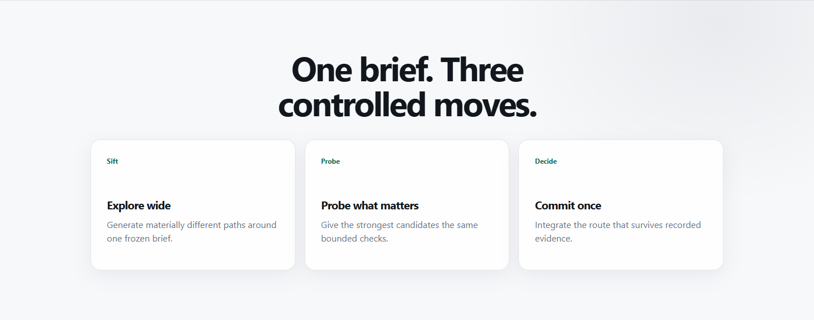
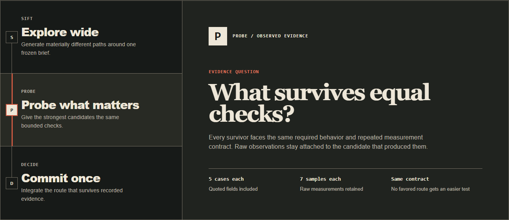
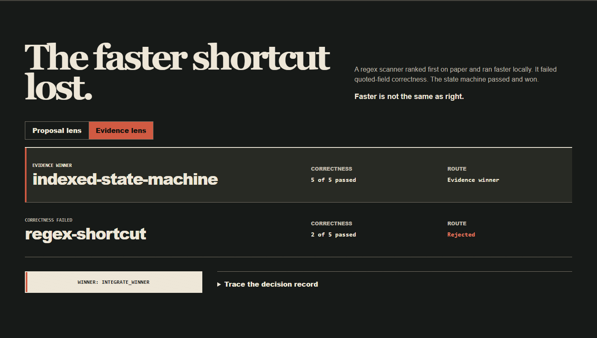

<p align="center">
  
</p>

<h1 align="center">JevRev</h1>

<p align="center"><strong>Explore wide. Prove cheap. Commit once.</strong></p>

<p align="center">
  <a href="https://github.com/Alex314618-create/JevRev/releases"></a>
  <a href="package.json"></a>
  <a href="LICENSE"></a>
</p>

JevRev is a tiered decision system for coding agents. It keeps the capable,
open-ended model focused on exploration and implementation, while Jev handles a
small surface of typed routing decisions.

Think brain and spinal cord, not one giant pipe. The coding agent proposes and
builds. JevRev freezes the brief, narrows the plausible paths, asks for
comparable evidence, and makes the next route explicit. Hosted Jev and local
models fit behind the same workflow, so the decision layer can match the cost,
latency, and privacy needs of the project.

## A faster shortcut lost

A small CSV scanner needed more throughput without changing quoted-field
behavior. Two implementations survived Sift and received the same correctness
checks and repeated benchmark protocol.


The regex was faster and wrong. The state machine was fast enough and preserved
the required behavior. Sift controlled what was worth testing; evidence
controlled what was worth integrating.

<a id="run-the-case"></a>

Reproduce the complete case locally:

```bash
git clone https://github.com/Alex314618-create/JevRev.git
cd JevRev
npm install
npm run demo:workflow
```

The demo executes both implementations, including correctness probes and seven
benchmark samples per implementation. Only the Jev answers are replayed to keep
routing deterministic. Throughput varies by machine; the pass/fail reversal does
not. Inspect the generated campaign, raw evidence, hashes, and final decision in
`benchmarks/results/workflow-demo/`.

## Use it from an agent

Install the CLI and its file-based agent skill:

```bash
npm install -g jevrev
jevrev-skill-install --target codex
```

Then give the coding agent one instruction:

```text
Use JevRev for this task: generate materially different hypotheses, sift them, run only the bounded probes, record raw evidence, decide from that evidence, and stop before merging.
```

The skill handles the JSON workflow and teaches the agent when a direct edit is
cheaper than a multi-path probe.

### Hosted Jev

```bash
export JEVREV_JEV_API_KEY="..."
jevrev sift --input proposals.json --provider jev
```

The default endpoint is `https://api.typesafe.ai/v1/systemone`. Credentials are
read from the environment and are never accepted as CLI arguments.

<a id="local-semif"></a>

### Local model

The tested local path runs Qwen3.5-4B GGUF behind llama.cpp:

```powershell
powershell -ExecutionPolicy Bypass -File scripts/start-semif.ps1 -Background
jevrev sift --input proposals.json --provider semif
```

Local inference can remove API spend from the decision layer, but it does not
make hardware or electricity free. See [`docs/SEMIF_LOCAL.md`](docs/SEMIF_LOCAL.md)
for setup and sizing notes.

Or hand setup back to the agent:

```text
Install JevRev, configure hosted Jev if JEVREV_JEV_API_KEY is available or the documented local SemIf provider otherwise, run jevrev doctor, and show me the configuration without exposing secrets.
```

## One brief, two one-shot pages

One content and behavior contract produced two committed pages. The direct path
keeps its first conventional rounded SaaS direction and removes imagery. The
JevRev path compares four mechanisms, selects a painterly evidence dossier, and
lets that mechanism control structure and evidence behavior.

<table>
  <tr>
    <th width="50%">Direct: first direction</th>
    <th width="50%">JevRev: selected direction</th>
  </tr>
  <tr>
    <td></td>
    <td></td>
  </tr>
  <tr>
    <td><sub>Centered hierarchy, soft elevation, static proof.</sub></td>
    <td><sub>Asymmetric case file, hard evidence grid, functional decision states.</sub></td>
  </tr>
</table>

The skull on the right is not a decorative import. It is the existing JevRev
illustration converted to transparent negative linework, so it shares the page
surface instead of sitting in a mismatched image box. The faint rust field stays
behind its upper-right edge. One asset decision establishes identity without
adding a new source image.

**Why the dossier won**

The four candidates were different page mechanisms, not palette variations.
The selection asked which mechanism could make identity, evidence, and route
changes legible under the same static-page constraints.

- `black-violet-interface-grid`: familiar scan and small implementation scope,
  but repeated equal frames could make the evidence reversal visually flat and
  interchangeable.
- `terminal-proof-stack`: command density could strengthen inspectability, but
  a transcript could look like simulated product output and make the skull
  incidental.
- `minimal-docs-masthead`: installation would be immediate, but the decision
  model could read as ordinary documentation and the route reversal could
  become secondary.
- `painterly-evidence-dossier`: **selected at 0.9149.** It could bind the
  existing skull, a semantic stage path, and an evidence lens into one
  inspectable page without a runtime dependency.

The controlled advantage in this case is not that one palette is universally
better. It is that a recorded route governs the asset, hierarchy, and behavior
together, and leaves those choices open to inspection.

<details>
<summary><strong>Inspect three decisions in the rendered pages</strong></summary>

**Keep the baseline honest.** The direct condition keeps its approved system
sans, rounded surfaces, green actions, equal modules, and centered narrow
layout. It omits imagery instead of being deliberately degraded for contrast.

<p align="center"></p>

<sub>Decision surfaces: direction route, hierarchy, and narrow-width behavior.</sub>

<p align="center"></p>

**Make sequence carry meaning.** The same three workflow steps become a
connected Sift, Probe, and Decide path. Selecting Probe changes the state mark,
question, body, and evidence facts as one readable state change.

<sub>Decision surfaces: information hierarchy, type, material, and motion.</sub>

**Let evidence change the composition.** The proposal lens starts with the regex
favorite. The evidence lens moves the passing state machine to the first DOM and
visual position, changes both candidate routes, and exposes the final decision
stamp.

<p align="center"></p>

<sub>Decision surfaces: proof behavior, reading order, and final route.</sub>

**Interaction contract**

| Surface | Input and information change |
| --- | --- |
| Decision rail | Tab to focus; click or arrow keys to select Sift, Probe, or Decide and read its question and facts. |
| Evidence lens | Click or keyboard activation replaces proposal readings with correctness results, reorders the candidates, and shows the final route. |
| Source trail | The native summary control reveals the executable case and validation record. |

With reduced motion, stage and evidence states update immediately without
animated travel. Native disclosure remains available.

</details>

Trace the [`contract`](benchmarks/one-shot-showcase/input.json),
[`direction set`](benchmarks/one-shot-showcase/sift-input.json),
[`deterministic replay`](benchmarks/one-shot-showcase/sift-replay.json), and
[`browser record`](benchmarks/one-shot-showcase/VALIDATION.md). Both pages are
real responsive fixtures. Inspect the
[`direct`](benchmarks/one-shot-showcase/direct/index.html) and
[`routed`](benchmarks/one-shot-showcase/routed/index.html) outputs, or reproduce
the four-direction selection and contract checks with `npm run demo:oneshot`.
This controlled showcase does not measure cost, generation time, business
lift, or universal design quality.

## The part that matters

A plan score is not proof. JevRev separates two decisions:

1. **Sift** asks whether a proposed mechanism is plausible, distinct, feasible,
   testable, and worth a bounded probe.
2. **Decide** starts with command exits, requirement results, raw metric samples,
   revision identity, and budgets. Jev then judges evidence coverage, residual
   risk, and shipping value.

```text
frozen brief -> 2-12 ideas -> Sift -> bounded probes -> evidence -> Decide
                                                                  |
                  integrate winner <- explicit next action <------+
```

A failed required test cannot be rescued by a high model score. Decide returns
`winner`, `merge`, `probe_more`, `no_winner`, or `human_review`.

## CLI

### 1. Sift the ideas

```bash
jevrev sift --input proposals.json --provider jev > campaign.json
```

Each survivor receives a work order with a hypothesis, smallest useful probe,
required evidence, budgets, and stop conditions. See
[`examples/parser-speedup.json`](examples/parser-speedup.json) for a complete
input. The original one-pass `run` and `rank` commands remain supported.

<a id="2-probe-in-isolation"></a>

### 2. Record the probes

The host agent implements work orders in isolated branches or worktrees. JevRev
records explicitly requested commands without a shell and keeps measurements,
artifacts, requirements, and revision identity bound to the correct candidate.

```bash
jevrev-evidence-template --campaign campaign.json --output evidence.json
jevrev evidence run --evidence evidence.json --candidate candidate-id --id tests -- npm test
jevrev evidence metric --evidence evidence.json --candidate candidate-id --input throughput.json
jevrev evidence artifact --evidence evidence.json --candidate candidate-id --id screenshot --file artifacts/home.png
jevrev evidence status --campaign campaign.json --evidence evidence.json
```

Incomplete templates cannot produce a winner. Metric summaries are recomputed
from raw samples, artifact paths are workspace-bound and stored by hash, and a
failed recorded command remains visible to both the agent and Decide.

### 3. Decide from evidence

```bash
jevrev decide --campaign campaign.json --evidence evidence.json --provider jev
```

The policy applies schema and hash checks, required commands, hard constraints,
and recomputed metrics before Jev reviews evidence sufficiency. Use `--replay`
for deterministic offline runs.

The full workflow is in [`docs/WORKFLOW.md`](docs/WORKFLOW.md). Wire formats and
exit codes are in [`docs/PROTOCOL.md`](docs/PROTOCOL.md).

## JevLoop: keep one artifact moving

JevLoop is the round boundary for a host agent that is already editing one
artifact. It does not launch the agent, merge code, or run in the background:
the host submits one evidence envelope, and JevRev returns a typed route.

```bash
jevrev loop create --directory .jevrev/parser-loop \
  --spec examples/loop-parser-spec.json \
  --base-revision "$(git rev-parse HEAD)"
jevrev loop next --directory .jevrev/parser-loop \
  --plan examples/loop-parser-plan.json --format json > round-work-order.json
jevrev loop evidence-template --directory .jevrev/parser-loop \
  --head-revision "$(git rev-parse HEAD)" --output round-evidence.json
jevrev loop audit --directory .jevrev/parser-loop \
  --evidence round-evidence.json --replay examples/loop-parser-replay.json
```

The template is JSON by default; pass `--format human` to inspect its unknown
slots at a terminal. Progress never claims completion. A completion audit needs
fresh evidence for every criterion and protected surface on the same head.
`loop resume`, `loop abort`, and `loop approve --yes` are explicit human
boundaries. See [`docs/JEVLOOP_DESIGN.md`](docs/JEVLOOP_DESIGN.md).

## JevLong: observe a long session

JevLong is a local, deterministic observer for a long-running agent session.
It consumes bounded JSONL events, keeps a hash-chained journal, and reports
stalls, repeated failures, drift, budget risk, and evidence-backed progress.
Healthy events do not call Jev, and `watch` never retries, stops, edits, or
advances a Loop.

```bash
jevrev long create --directory .jevrev/long \
  --spec examples/long-session-spec.json --format json
jevrev long ingest --directory .jevrev/long --input examples/long-events.jsonl
jevrev long status --directory .jevrev/long --format json
jevrev long watch --directory .jevrev/long --interval-ms 1000
```

The watch command is a keyboard cockpit for the observer state, not an agent
control panel. Use `1`-`4` for panes, `Tab` to move focus, `r` to refresh, and
`q` to leave. See [`docs/JEVLONG_DESIGN.md`](docs/JEVLONG_DESIGN.md).

## Product layers

JevRev is the umbrella for a layered agent control system. Today it ships the
decision spine that later layers can reuse.

| Layer | Role | Status |
| --- | --- | --- |
| **JevSift** | Filter proposal cards and issue bounded work orders | Shipped as `jevrev sift` |
| **Probe + Decide** | Validate recorded evidence and return the next route | Shipped as `jevrev decide` |
| **JevLoop** | Audit a completed agent round and choose continue, revise, stop, or ask | Shipped as `jevrev loop` |
| **JevLong** | Watch long sessions for drift, stalls, repeated failures, and budget risk | Shipped as `jevrev long` |

Both layers remain explicit command-line workflows. There is no hidden always-on
loop, agent controller, or monitoring daemon.

## Providers

| Mode | Best for | Endpoint |
| --- | --- | --- |
| Hosted Jev | Managed typed decisions | `https://api.typesafe.ai/v1/systemone` |
| Local SemIf | Local inference through llama.cpp | `http://127.0.0.1:4878/v1/chat/completions` |
| Legacy local | Existing reranker deployments | `http://127.0.0.1:4877/v1/score` |
| Replay | Offline, deterministic development | Local response file |

All four modes support both Sift and Decide. Override hosted and local roots with
the documented flags or environment variables, and use
`jevrev doctor --format json --check` to inspect configured endpoints. When
`--provider local` or `--provider semif` is selected, an unreachable or 4xx/5xx
health endpoint returns exit code `3` for scripts.

## What JevRev does not do

JevRev does not:

- force several ideas onto an obvious one-line fix;
- build complete products just to compare them;
- treat a model probability or builder note as ground truth;
- choose or execute arbitrary shell commands;
- create worktrees, merge branches, or modify the user's repository;
- force a winner when every probe fails.

Use it when wrong-path regret is larger than the cost of two small probes. Skip
it when the solution is obvious or cheap to reverse.

## One-pass benchmark record

Before the evidence workflow existed, JevSift was tested on three local
Qwen3.5-4B scenarios with rotated candidate order. The returned shortlist's best
utility stayed unchanged across those rotations. This is an order-sensitivity
record, not a claim about production quality, time, or cost.

The method, samples, and limitations are preserved in
[`docs/ACCEPTANCE.md`](docs/ACCEPTANCE.md). New users should start with the
ranking-reversal demo above because it exercises the complete current workflow.

## Documentation

| Question | Read |
| --- | --- |
| How does the evidence workflow operate? | [`docs/WORKFLOW.md`](docs/WORKFLOW.md) |
| What are the schemas, outputs, and exit codes? | [`docs/PROTOCOL.md`](docs/PROTOCOL.md) |
| What has actually been tested? | [`docs/ACCEPTANCE.md`](docs/ACCEPTANCE.md) |
| How do I run the local provider? | [`docs/SEMIF_LOCAL.md`](docs/SEMIF_LOCAL.md) |
| What are the Loop and Long contracts? | [`docs/JEVLOOP_DESIGN.md`](docs/JEVLOOP_DESIGN.md), [`docs/JEVLONG_DESIGN.md`](docs/JEVLONG_DESIGN.md) |
| What are the design boundaries? | [`docs/DESIGN.md`](docs/DESIGN.md) |

## Development

```bash
npm install
npm run check
npm test
npm run build
npm run demo:all
npm run demo:workflow
npm pack --dry-run
```

Node.js 20 or newer is required. Generated benchmark artifacts and credentials
are excluded from the package.

## License

[MIT](LICENSE)
