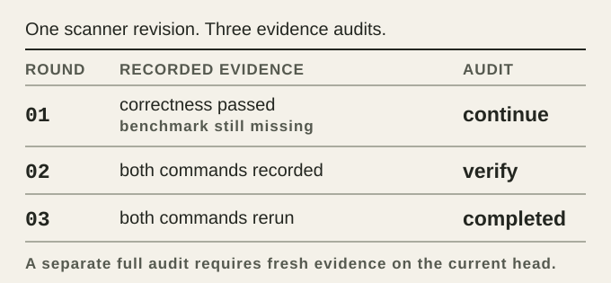
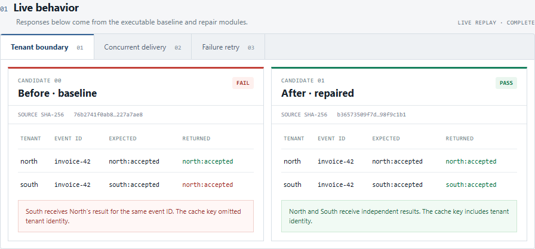

# JevRev

<p align="center">
  
</p>

<p align="center"><strong>The decision layer beside your LLM.</strong></p>

<p align="center">
  <a href="https://github.com/Alex314618-create/JevRev/releases"></a>
  <a href="package.json"></a>
  <a href="LICENSE"></a>
</p>

> Shortlist the options. Score in a loop. Watch the run.

Your LLM can imagine, write, test, and revise. It should not have to make every
cheap routing decision by itself.

JevRev puts Jev beside the LLM: a semantic layer that filters
plans, checks progress, and keeps attention on the work worth continuing. The
LLM supplies breadth and implementation power. JevRev supplies the second look
before more time and tokens are spent.

That is JevRev: not another coding agent, but the decision system around one.

## See the idea

The included case asks for a faster CSV parser. The LLM proposes a tempting
regex shortcut and a more careful state machine. The shortcut wins the paper
ranking, then fails the correctness check. The state machine is slower, passes
the same checks, and becomes the evidence winner.

<picture>
  <source media="(max-width: 600px)" srcset=".github/assets/jevrev-decision-gate-mobile.svg">
  
</picture>

Run the complete case:

```bash
git clone https://github.com/Alex314618-create/JevRev.git
cd JevRev
npm install
npm run build
npm run demo:workflow
```

The Jev answers are replayed for a deterministic demo. The implementations,
correctness checks, benchmark samples, output digests, and final decision are
real:

```text
Paper favorite: regex-shortcut
  correctness command: failed
  result: rejected

Evidence winner: indexed-state-machine
  correctness command: passed
Decision: winner -> integrate_winner
```

Inspect the [executed probe](benchmarks/workflow-fixture/probe.mjs),
[demo driver](scripts/run-workflow-demo.mjs), and
[decision tests](tests/workflow-decide.test.ts). The measured throughput varies
by machine; the required correctness failure is what reverses the ranking.

## The three parts

<picture>
  <source media="(max-width: 600px)" srcset=".github/assets/jevrev-product-roles-mobile.svg">
  
</picture>

### JevSift: choose the work

The host LLM proposes a few materially different approaches. JevSift removes
weak, duplicate, risky, or low-value paths before they consume implementation
budget, then emits bounded work orders for the survivors.

### JevLoop: improve one artifact

The host agent executes a bounded work order, records what actually happened,
and submits the round to JevLoop. Loop checks the evidence, asks Jev only the
narrow questions that facts cannot settle, and returns the next action: continue,
fix, verify, replan, wait for a human, or finish when every criterion is proven.

This is where `Probe`, `Evidence`, and `Decide` belong in the product story:
they are Loop's working machinery, not another product surface.

### JevLong: watch the session

JevLong observes a long-running agent session and reports stalls, repeated
failures, drift, tool-call problems, budget risk, and progress to a human. It
does not silently steer, retry, edit, or kill the agent.

The [event fixture](examples/long-events.jsonl) and
[signal tests](tests/long-signals.test.ts) show what it observes and reports.

## Run a Loop trace

The offline demo audits the same indexed-state-machine revision used above. It
records actual correctness and benchmark command outcomes; Loop itself edits
nothing.

<picture>
  <source media="(max-width: 600px)" srcset=".github/assets/jevrev-loop-trace-mobile.svg">
  
</picture>

```bash
npm run demo:loop
```

The command prints its artifact directory. Inspect `trace.json`, the three
evidence files, and Loop's verified event log there. The
[demo source](scripts/run-loop-demo.mjs) and
[automated test](tests/readme-loop-demo.test.ts) use the recorded command outcomes;
neither infers completion from a model score.

## Engineering case: a webhook under repair

Picture an AI coding agent implementing a multi-tenant invoice webhook. A local
replay workbench makes the failure visible: the baseline returns North's result
to South for the same event ID, and two concurrent deliveries execute the
handler twice. The repaired version isolates tenants and shares in-flight work.
The captured panels come from actual fixture code, using the same scenarios as
the recorded command checks.

<picture>
  <source media="(max-width: 600px)" srcset=".github/assets/engineering-showcase/webhook-mobile.png">
  
</picture>

The concurrency tab shows the second failure: the same two deliveries cause
**two** handler executions before the repair and **one** after it. [See the
concurrency capture](.github/assets/engineering-showcase/webhook-race.png).

```bash
npm run demo:engineering
npm run showcase:engineering
```

Open the printed local URL to replay all three scenarios. The CLI run prints a
directory containing command reports, evidence files, and verified journals.
The [captured run](benchmarks/engineering-showcase/capture/trace.json) records
`fix_regression → verify → completed`: Loop cannot finish until the unchanged
repair passes fresh commands in a full completion audit. Long then imports each
audit only after checking its Loop ID, work order, outcome, and evidence hash.
It rejects a wrong digest and deduplicates a repeated event.

This shows the layers an AI coding developer can use: the host writes code;
Evidence records what ran on which revision; Loop turns those facts into the
next bounded action; Long watches the verified session without changing it.
Sift can select the upstream approach, but this case begins after that choice.
See the [case source and architecture](benchmarks/engineering-showcase/README.md)
for replay steps, source revisions, and interpretation limits.

## Use it from Codex

Build the CLI and install the bundled skill into Codex:

```bash
npm install
npm run build
node scripts/install-skill.mjs --target codex
```

Then give the host agent this instruction:

```text
Use JevRev for this task. Propose materially different approaches, ask JevRev
to sift them, run only the bounded probes, record the evidence, and let JevRev
audit the next round before continuing.
```

## The command surface

| Command | Role in the LLM + Jev workflow |
| --- | --- |
| `jevrev sift` | Decide which proposed approaches deserve a probe |
| `jevrev loop` | Audit one artifact after each agent round |
| `jevrev long` | Observe the health of a long-running session |

`jevrev evidence` and `jevrev decide` are lower-level infrastructure commands.
They record and adjudicate the facts that JevSift and JevLoop consume; they are
not a fourth and fifth product component.

From source, use `node dist/cli.js` in place of `jevrev`:

```bash
node dist/cli.js sift --input proposals.json --replay examples/parser-jev-response.json
```

## Providers

JevRev keeps the decision boundary the same whether Jev is hosted, local, or
replayed:

Hosted Jev in a POSIX shell:

```bash
export JEVREV_JEV_API_KEY="..."
node dist/cli.js sift --input proposals.json --provider jev
```

Local SemIf through llama.cpp on Windows:

```powershell
powershell -ExecutionPolicy Bypass -File scripts/start-semif.ps1 -Background
node dist/cli.js sift --input proposals.json --provider semif
```

Replay fixtures work without a network or API key. See
[`docs/SEMIF_LOCAL.md`](docs/SEMIF_LOCAL.md) for the local model setup.

## One brief, two outcomes

JevRev is useful beyond code paths. The repository includes two pages made from
the same brief: a conventional first pass and a JevRev-routed evidence dossier.

<table>
  <tr>
    <th width="50%">First pass</th>
    <th width="50%">JevRev route</th>
  </tr>
  <tr>
    <td></td>
    <td></td>
  </tr>
</table>

The point is not a magic visual score. It is that the route chosen by Jev can
change the artifact's structure, evidence, and final direction together.
See the [source pages](benchmarks/one-shot-showcase/README.md) and their
[validation record](benchmarks/one-shot-showcase/VALIDATION.md) before comparing
the screenshots.

## Read next

- [Workflow guide](docs/WORKFLOW.md)
- [Protocol and JSON contracts](docs/PROTOCOL.md)
- [Authority model](docs/AUTHORITY.md)
- [JevLoop design](docs/JEVLOOP_DESIGN.md)
- [JevLong design](docs/JEVLONG_DESIGN.md)
- [Acceptance record](docs/ACCEPTANCE.md)

## Development

```bash
npm install
npm run check
npm test
npm run build
npm run demo:all
npm run demo:workflow
npm run demo:loop
npm run demo:engineering
```

Node.js 20 or newer is required. JevRev is MIT licensed.

[MIT](LICENSE)
