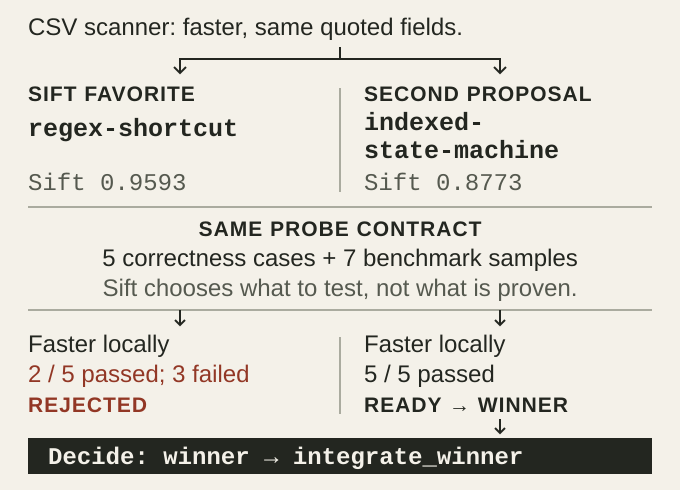
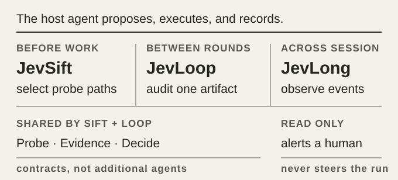
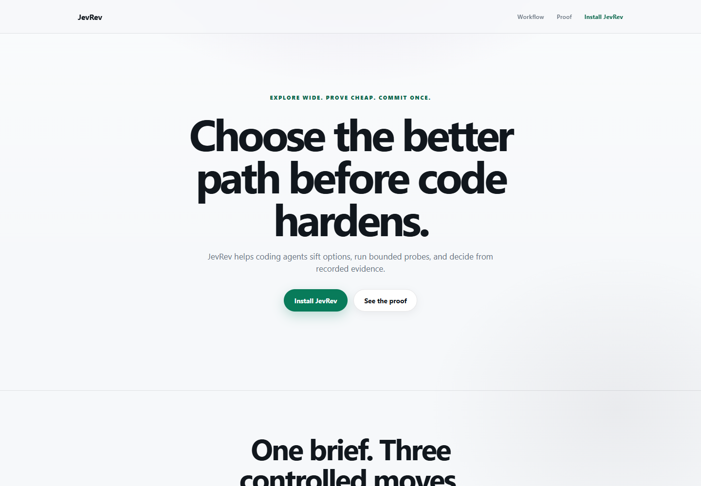
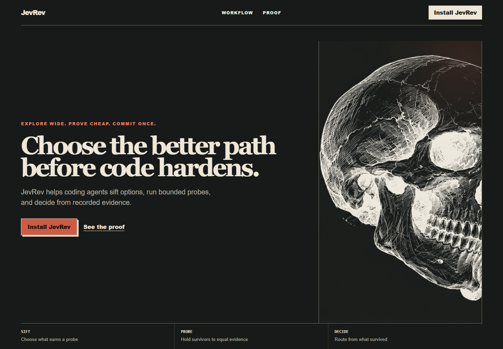

# JevRev

<p align="center">
  
</p>

<p align="center"><strong>给你 LLM 加一层决策。</strong></p>

<p align="center">
  <a href="README.md">English</a> · <a href="README.zh-CN.md">简体中文</a>
</p>

<p align="center">
  <a href="https://github.com/Alex314618-create/JevRev/releases"></a>
  <a href="package.json"></a>
  <a href="LICENSE"></a>
</p>

> 先筛方案，再一轮轮打分，最后盯着跑完。

你的 LLM 很能干：想方案、写代码、跑测试、改错，样样都行。

但像"该选哪个方案"这种小判断，本来就不必惊动它。

JevRev 就是把这一层单独拿出来。Jev 坐在 LLM 旁边，筛方案、盯进度，把力气留在还值得继续的事上。想法和实现由 LLM 出；JevRev 出的是那"第二眼"——在你继续烧时间和 token 之前。

它不是又一个 coding agent。它是给 agent 配的那套决策系统。

## 先看个例子

仓库里带了个能跑的案例：写一个更快的 CSV 解析器。

LLM 给两条路。一条用正则抄近路，省事，纸面上也好看。另一条老老实实写状态机，慢一点。

纸面上抄近路的那条赢。可正确性检查一跑，它挂了。状态机慢是慢，同样的检查全过——凭证据翻了盘。

<picture>
  <source media="(max-width: 600px)" srcset=".github/assets/jevrev-decision-gate-mobile.svg">
  
</picture>

想自己跑一遍：

```bash
git clone https://github.com/Alex314618-create/JevRev.git
cd JevRev
npm install
npm run build
npm run demo:workflow
```

为了让 demo 每次结果都一样，这里的 Jev 回答是预先录好的。除了它，别的都是真的：实现是真的，正确性检查是真的，benchmark 采样和输出摘要是真的，最后那个决定也是真的。

```text
Paper favorite: regex-shortcut
  correctness command: failed
  result: rejected

Evidence winner: indexed-state-machine
  correctness command: passed
Decision: winner -> integrate_winner
```

想深挖，这三个文件可以点开看：[真正跑过的探针](benchmarks/workflow-fixture/probe.mjs)、[demo 的驱动脚本](scripts/run-workflow-demo.mjs)、[决策测试](tests/workflow-decide.test.ts)。吞吐量的实测值每台机器都不一样。真正让排名翻盘的也不是速度——是那条必须通过的正确性检查没过。

## 三个组成部分

<picture>
  <source media="(max-width: 600px)" srcset=".github/assets/jevrev-product-roles-mobile.svg">
  
</picture>

### JevSift：定下做什么

你的 LLM 会先给你几个方案，方向越不一样越好。JevSift 先过一遍：虚的扔了，跟别人重复的扔了，风险太大的扔了，费力不讨好的也扔了。

剩下的才配拿到一张范围明确的任务单。

### JevLoop：打磨一件产物

你的 agent 按任务单做完一轮，如实记下发生了什么，交给 JevLoop。

Loop 先看证据。事实讲得清的，它自己就定了；讲不清的，才拿去问 Jev。然后它会告诉你下一步：要么接着做，要么先修，要么验一遍，要么推倒重新规划；也可能它觉得该等人来拍板了。所有标准都过了，它就收工。

`Probe`、`Evidence`、`Decide` 都在这里面，是 Loop 自己转起来的零件——不是另外几个界面。

### JevLong：盯着整个会话

JevLong 盯的是长跑会话，只管报信。要是卡住了、同一个坑反复失败、方向开始跑偏、工具调用出问题、预算快见底——它都会告诉你。当然，正常跑到哪了，也报。

但它只报信，不动手。不会悄悄给你改方向，不会自动重试，不会替你改文件，更不会自己把 agent 掐了。

`long watch` 是实时终端面板。要给脚本用、要机器能读的输出，改用 `long status --format json`；`watch` 不接受 `--format`。

说穿了就一句：费钱、要用脑子的活让 LLM 干，JevRev 拦着它别一次次往错路上撞。

## 在 Codex 里用

先构建 CLI，再把仓库里附带的 skill 装进 Codex：

```bash
npm install
npm run build
node scripts/install-skill.mjs --target codex
```

然后给 agent 这句指令：

```text
Use JevRev for this task. Propose materially different approaches, ask JevRev
to sift them, run only the bounded probes, record the evidence, and let JevRev
audit the next round before continuing.
```

## 命令一览

| 命令 | 在 LLM + Jev 的工作流里管什么 |
| --- | --- |
| `jevrev sift` | 定哪些方案值得动手试一次 |
| `jevrev loop` | agent 每跑完一轮，复核一件产物 |
| `jevrev long` | 盯一个长跑会话还健不健康 |

`jevrev evidence` 和 `jevrev decide` 更底层。JevSift 和 JevLoop 要吃的那份事实数据，就靠它们记下来、裁定掉。这两个不算第四、第五个产品组件。

从源码跑的话，`jevrev` 换成 `node dist/cli.js`：

```bash
node dist/cli.js sift --input proposals.json --replay examples/parser-jev-response.json
```

## 模型接入

Jev 走云端、跑本地、还是重放，JevRev 的决策边界都不变。

POSIX shell 里用云端 Jev：

```bash
export JEVREV_JEV_API_KEY="..."
node dist/cli.js sift --input proposals.json --provider jev
```

Windows 上通过 llama.cpp 跑本地 SemIf：

```powershell
powershell -ExecutionPolicy Bypass -File scripts/start-semif.ps1 -Background
node dist/cli.js sift --input proposals.json --provider semif
```

重放用的预置数据不需要联网，也不需要 API key。本地模型怎么搭，见 [`docs/SEMIF_LOCAL.md`](docs/SEMIF_LOCAL.md)。

## 同一份需求，两种结果

JevRev 不只在代码上有用。仓库里放了两个页面，同一份需求做出来的：一个是不用 JevRev、常规出稿的初版；另一个是交给 JevRev 选完路线之后，产出的证据档。

<table>
  <tr>
    <th width="50%">常规初版</th>
    <th width="50%">JevRev 路线</th>
  </tr>
  <tr>
    <td></td>
    <td></td>
  </tr>
</table>

重点不是什么玄乎的视觉评分。重点在于：Jev 选了哪条路，产物的结构、证据和最后的方向就跟着一起变。要拿两张截图互相比，先去看[源页面](benchmarks/one-shot-showcase/README.md)和它们的[验证记录](benchmarks/one-shot-showcase/VALIDATION.md)。

## 延伸阅读

- [工作流指南](docs/WORKFLOW.md)
- [协议与 JSON 契约](docs/PROTOCOL.md)
- [权限模型](docs/AUTHORITY.md)
- [JevLoop 设计](docs/JEVLOOP_DESIGN.md)
- [JevLong 设计](docs/JEVLONG_DESIGN.md)
- [验收记录](docs/ACCEPTANCE.md)

## 本地开发

```bash
npm install
npm run check
npm test
npm run build
npm run demo:all
npm run demo:workflow
npm run demo:loop
npm run demo:engineering
```

需要 Node.js 20 或更高版本。JevRev 用 MIT 许可。

[MIT](LICENSE)
