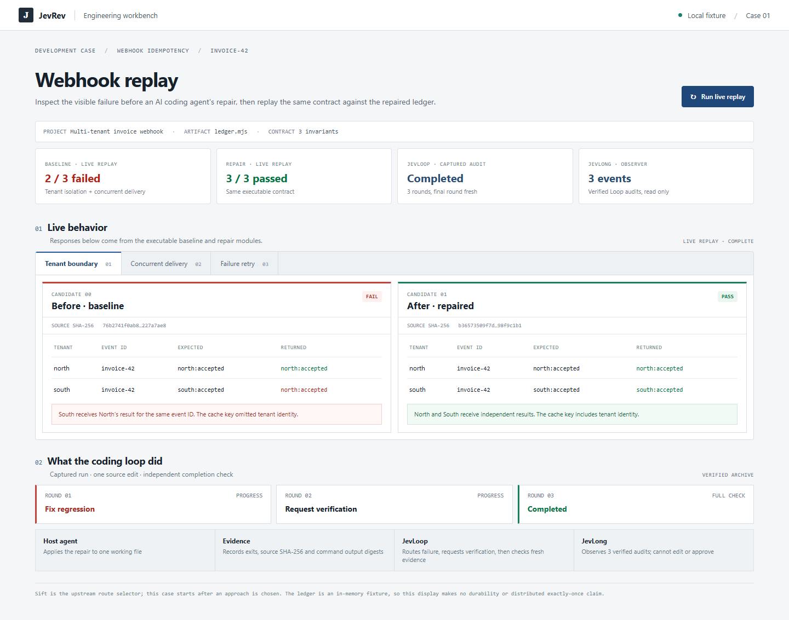
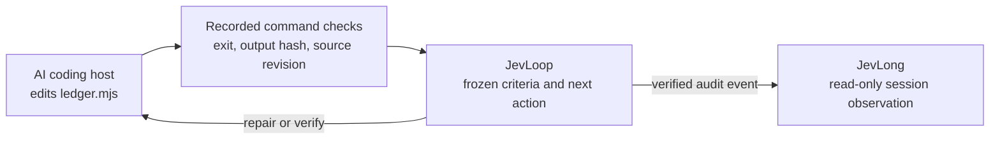

# Engineering case 01: a webhook under repair

An AI coding agent is building a multi-tenant invoice webhook. It needs to
process an event once per tenant, coalesce simultaneous retries, and permit a
new attempt after a handler failure. The [local replay workbench](workbench.html)
shows those behaviors as returned values and handler counts. The underlying
ledger is the same executable fixture used by the CLI audit.



The [concurrent-delivery capture](../../.github/assets/engineering-showcase/webhook-race.png)
shows a second observable defect: two incoming deliveries run the baseline
handler twice, while the repaired ledger runs it once. The
[mobile capture](../../.github/assets/engineering-showcase/webhook-mobile.png)
shows the same developer workflow at a narrow width.

## Run the visible scenario

```bash
npm install
npm run build
npm run showcase:engineering
```

Open the printed `127.0.0.1` URL. The three tabs run the
[shared scenarios](scenarios.mjs) against the committed
[baseline](baseline.mjs) and [repair](repaired.mjs) modules on every replay.
The tenant tab displays the observed values, the concurrency tab displays
handler executions, and the retry tab displays a rejected first attempt
followed by a successful second attempt. The workbench's lower audit strip
comes from the committed [captured run](capture/trace.json); it is labelled as
an archive so it is not confused with a new browser replay.

## Run the audited coding loop

```bash
npm run demo:engineering
```

The [driver](../../scripts/run-engineering-showcase.mjs) prints an ignored
`benchmarks/results/engineering-*/` directory. It starts with the baseline in
one working `ledger.mjs`, records all three command checks, copies the repair
into that same file, then asks Loop to audit the repair and perform a separate
fresh completion round. The [command wrapper](check.mjs) uses the same scenario
functions as the browser workbench and returns a process exit code that matches
the saved report.

| Frozen check | Baseline | Repaired round | Fresh completion round |
| --- | --- | --- | --- |
| Tenant identity in event key | fail | pass | pass |
| Concurrent duplicate executes once | fail | pass | pass |
| Failure permits later retry | pass | pass | pass |

The observed Loop outcomes are `fix_regression → verify → completed`.
The second and third rounds use the same repaired source SHA-256. The final
round reruns the required commands; it does not infer completion from a prior
pass or a model score. This case uses deterministic criteria, so it needs no
provider call.

## What each layer contributes



- **Host agent:** supplies and edits the implementation. JevRev does not write
  the repair in this case.
- **Probe and Evidence:** execute the checks and bind each observation to the
  active work order and source revision. The visible workbench and the CLI
  checks share the same scenario logic.
- **JevLoop:** compares recorded results to the frozen contract, routes the
  failures back to the host, then demands fresh full verification before
  completion.
- **JevLong:** accepts only audit events that match Loop's verified journal.
  A wrong evidence hash is rejected; an identical replay is deduplicated. Long
  records the state without editing, retrying, or approving the artifact.
- **JevSift:** belongs before this case, when deciding which implementation
  approach deserves a build. It is not exercised by this run.

The [committed capture](capture/) contains the original check reports,
`evidence-1.json` through `evidence-3.json`, the Loop and Long hash-linked
event journals, frozen specs, final ledger, and `trace.json`. The screenshot's
audit summary is drawn from that capture. See [validation](VALIDATION.md) for
browser and command verification.

## Scope of the claim

The tests establish these three in-memory behaviors for this fixture. They do
not establish durable storage, distributed exactly-once delivery, production
throughput, or general reliability of AI-generated code.
